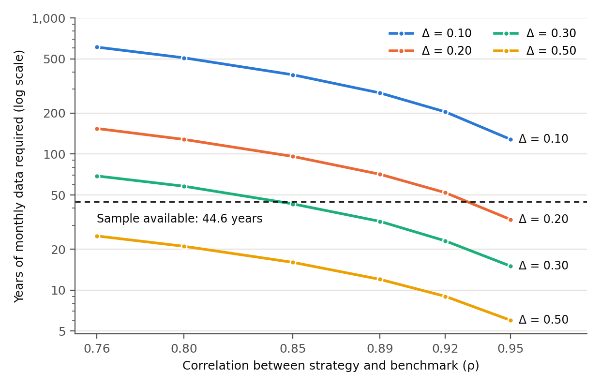
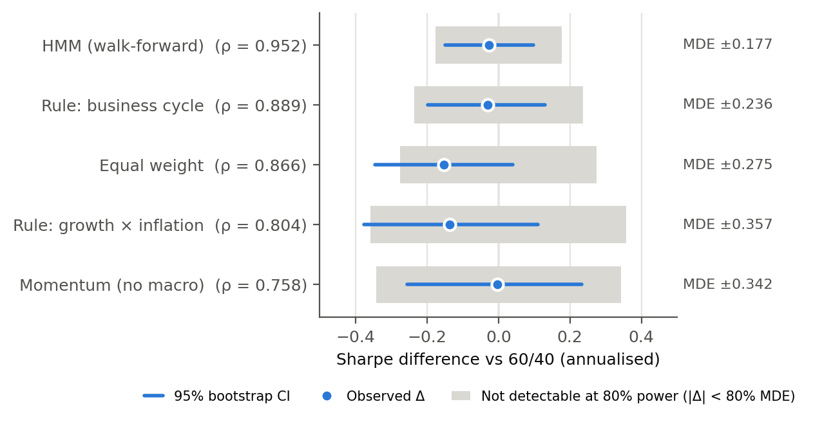

# Macroeconomic Regime Detection

[](https://doi.org/10.5281/zenodo.22737848)

A real-time macroeconomic regime-detection and asset-allocation pipeline, and a statistical power analysis of what a backtest built on it can and cannot show.

**Working paper:** *Underpowered by Construction: Why Backtests Cannot Detect Sharpe Differences of 0.1* (Ethan Gao, 2026). SSRN link coming soon.

---

## Contents

- [Summary](#summary)
- [Results](#results)
- [How it works](#how-it-works)
- [Getting started](#getting-started)
- [Outputs](#outputs)
- [Repository layout](#repository-layout)
- [Tests](#tests)
- [Limitations](#limitations)
- [Citation](#citation)
- [License](#license)

---

## Summary

The project asks two questions:

1. Does a systematic macroeconomic regime model, built without look-ahead bias, beat a rebalanced 60/40 portfolio?
2. Could a backtest of realistic length tell if it did?

The answers:

- **No strategy beats the benchmark.** Over 535 months (December 1981 to August 2026), the walk-forward hidden Markov model earns an excess-return Sharpe ratio of **0.655** against the benchmark's **0.682** (p = 0.64), and no other strategy differs significantly either.
- **Removing look-ahead bias changed nothing detectable.** Restoring three kinds of look-ahead bias, alone and in combination, produces no difference that survives multiple-testing correction.
- **The backtest could not have told.** Detecting a true 0.1 Sharpe improvement with 80% power takes between **128 and 610 years** of monthly data, depending on the correlation between strategy and benchmark. The smallest differences these comparisons could reliably detect range from **0.18 to 0.36**, and their power against a true 0.1 improvement from **12% to 35%**.

The practical point: for a strategy that tracks its benchmark closely, a Sharpe ratio comparison is effectively a test of the information ratio, and the correlation between strategy and benchmark, which studies rarely report, largely decides whether a claim can be tested at all.

---

## Results

### Strategy performance

December 1981 to August 2026, 535 months. Stocks, bonds and commodities, 10 basis points of transaction costs, trades one month after each signal. Sharpe ratios use returns in excess of the three-month Treasury bill.

| Strategy | Ann. return | Ann. vol | Sharpe | Max drawdown | ρ vs 60/40 | Δ vs 60/40 | p |
|---|---|---|---|---|---|---|---|
| **60/40 (rebalanced)** | 10.61% | 10.32% | **0.682** | −28.45% | | | |
| Momentum (prices only) | 10.07% | 9.52% | 0.679 | −27.99% | 0.758 | −0.003 | 0.999 |
| Hidden Markov model (walk-forward) | 10.08% | 9.93% | 0.655 | **−23.30%** | 0.952 | −0.027 | 0.636 |
| Rule: business cycle | 10.16% | 10.12% | 0.652 | −32.46% | 0.889 | −0.031 | 0.707 |
| Rule: growth × inflation | 8.83% | 9.79% | 0.546 | −40.97% | 0.804 | −0.136 | 0.298 |
| Equal weight | 7.78% | 7.94% | 0.529 | −32.62% | 0.866 | −0.153 | 0.121 |

The hidden Markov model's one clear advantage is a smaller maximum drawdown (−23.3% against −28.5%). It cuts risk heading into downturns without improving risk-adjusted return.

### How much history a Sharpe comparison needs

Jobson and Korkie (1981), with Memmel's (2003) correction, give the number of monthly observations needed to detect a true difference δ between two Sharpe ratios:

```
T = [ 2 − 2ρ + ½(S₁² + S₂² − 2·S₁·S₂·ρ²) ] · [ (z₁₋α/₂ + z₁₋β) / δ ]²
```

The required sample grows with 1/δ², and the leading 2(1 − ρ) term makes it depend mainly on the correlation between strategy and benchmark. Dropping the small Sharpe ratio terms gives a practitioner's version in years: **years ≈ (2.80 / IR)²**, where IR ≈ Δ / √(2(1 − ρ)) is the annualized information ratio of the active position. A 0.1 improvement at a correlation of 0.95 is an information ratio of about 0.32, which takes about 78 years to detect even if returns were normal and independent.

Real returns are fat-tailed and serially dependent. Stationary-bootstrap standard errors are larger than the closed form in every comparison, by a median factor of 1.248 (range 1.154 to 1.339), so required samples are scaled by the variance factor 1.558.

**Years of monthly data needed to detect a Sharpe ratio difference (80% power, 5% significance):**

| ρ | Δ = 0.10 | Δ = 0.20 | Δ = 0.30 | Δ = 0.50 |
|---|---|---|---|---|
| 0.76 | 610 | 154 | 69 | 25 |
| 0.80 | 509 | 128 | 58 | 21 |
| 0.85 | 382 | 96 | 43 | 16 |
| 0.89 | 281 | 71 | 32 | 12 |
| 0.92 | 204 | 52 | 23 | 9 |
| 0.95 | 128 | 33 | 15 | 6 |



### What each comparison could detect

The minimum detectable effect (MDE) is the smallest true difference a test finds with 80% probability. Power is reported against a fixed improvement of 0.1, because power computed at the observed difference is just a transformation of the p-value (Hoenig and Heisey 2001).

| Comparison with 60/40 | ρ | MDE (80% power) | Observed Δ | Power against Δ = 0.10 |
|---|---|---|---|---|
| Hidden Markov model | 0.952 | 0.177 | −0.027 | 35% |
| Rule: business cycle | 0.889 | 0.236 | −0.031 | 22% |
| Equal weight | 0.866 | 0.275 | −0.153 | 17% |
| Rule: growth × inflation | 0.804 | 0.357 | −0.136 | 12% |
| Momentum (prices only) | 0.758 | 0.342 | −0.003 | 13% |



### Look-ahead ablation

A 2×2×2 factorial design restores three kinds of look-ahead bias: **A** ignores publication lags, **B** uses state probabilities computed from the whole sample, and **C** estimates the model once on the whole sample instead of re-estimating it over time. All cells use the same 536 months.

| Biases restored | Sharpe | Δ vs careful version | p | Holm p | ρ vs careful | MDE (80% power) |
|---|---|---|---|---|---|---|
| None (careful version) | 0.655 | | | | | |
| A | 0.553 | −0.102 | 0.013 | 0.179 | 0.974 | 0.149 |
| B | 0.685 | +0.030 | 0.036 | 0.468 | 0.993 | 0.049 |
| C | 0.604 | −0.051 | 0.313 | 1.000 | 0.961 | 0.143 |
| A and B | 0.614 | −0.041 | 0.171 | 1.000 | 0.982 | 0.085 |
| A and C | 0.615 | −0.040 | 0.419 | 1.000 | 0.963 | 0.139 |
| B and C | 0.640 | −0.015 | 0.799 | 1.000 | 0.960 | 0.146 |
| A, B and C | **0.654** | **−0.001** | 0.998 | 1.000 | 0.962 | 0.139 |

- Across all 14 tests (these seven, plus seven with in-sample optimized allocations), two are nominally significant where 0.7 would be expected by chance. None survives the Holm or Benjamini–Hochberg adjustment.
- With optimized allocations, the fully biased version earns 0.676 against 0.688 for the reference, and no cell reaches even nominal significance (smallest p = 0.198).
- Because each biased version is highly correlated with the careful one, this experiment was more sensitive than the strategy comparisons. The 95% interval for the fully biased version, −0.096 to +0.098, rules out a combined look-ahead effect much larger than 0.1, although smaller effects cannot be ruled out.

### Other findings

- **Specification sensitivity.** The business cycle rule's difference from 60/40 ranges from +0.133 (sample from 2001, gold included) to −0.067 (sample from 1990, no gold), and none is significant. Across the four samples without gold the range is only 0.042, so most of the swing comes from including gold.
- **Recession classification.** Against NBER dates, the business cycle rule catches 90.6% of recession months but only 32.6% of its recession calls are right: 159 false-positive months over 33 episodes, 27 of them lasting three months or more. The real-time Sahm rule scores a higher F1 (0.525 against 0.480).
- **Regime-conditional correlations.** The stock–bond correlation ranges from −0.04 in recovery to 0.17 in slowdown, against 0.08 unconditionally, a spread too small to support much regime-based reallocation in this sample.

---

## How it works

### Data

- **25 FRED series** covering growth, inflation, financial conditions and monetary policy.
- **Point-in-time alignment.** Each series carries its real publication lag, so the feature row for month-end *T* contains only data released by *T*. FRED dates monthly observations to the first day of the reference month (March CPI is stamped 1 March but published in mid-April), so using the data as dated would trade on figures that did not yet exist.
- **Substitutions.** FRED now serves the ICE BofA high-yield spread (`BAMLH0A0HYM2`) only for a rolling three-year window, so the Chicago Fed National Financial Conditions Index (from 1971) and the Moody's Baa–Aaa spread (from 1919) replace it. ISM PMI series were withdrawn in 2016 and are replaced by the Chicago Fed National Activity Index.
- **Long-history returns.** ETF histories cover only two recessions, so long proxies are spliced behind them: the Kenneth French market return for equities (from 1926), a duration-based reconstruction from 10-year yields for bonds, and PPI All Commodities (from 1913). Gold data starts in 2000, so gold is used only in the specification-sensitivity analysis.

### Models

- **Two rule-based models:** a growth × inflation quadrant model and a four-phase business cycle model, both with a ±0.25σ deadband and two-month confirmation.
- **A Gaussian hidden Markov model** with three states, selected on seed stability and episode counts (BIC keeps falling up to eight states, a sign of non-Gaussian data rather than real structure).
  - Probabilities are **filtered**, using only data up to each month. Standard `predict()` and `predict_proba()` use the whole sample, so the forward recursion is implemented directly and checked three ways: it matches the smoothed probabilities at the final step (to 2.6e-14), matches an independent implementation (to 4.4e-16), and differs from the smoothed probabilities elsewhere (5.4% of months).
  - The model is **re-estimated 45 times** on expanding windows, with a live signal from December 1981, and states are **relabelled deterministically** after each fit so a state means the same thing throughout.

### Backtest and statistics

- Signals at month-end *T* are traded at *T* + 1, with 10 basis points charged on turnover. Allocations blend fixed per-regime weights by regime probability; the weights are set by hand, so the main results involve no fitted parameters.
- The benchmark is a monthly rebalanced 60/40 portfolio under the same costs, plus a momentum strategy that uses no macro data at all.
- Differences are tested with a paired stationary bootstrap (5,000 replications, 12-month mean block). Confidence intervals and p-values come from the same distribution, so they always agree.
- Multiple testing is handled with Holm and Benjamini–Hochberg adjustments; regime-conditional forward returns use Newey–West standard errors.

---

## Getting started

```bash
python -m venv .venv
.venv\Scripts\activate          # Windows; use `source .venv/bin/activate` elsewhere
pip install -e .
```

> **Python 3.12 is required.** `hmmlearn` has no wheels for 3.13 and later, and building it from source needs the MSVC C++ toolchain.

Everything runs offline from the committed data cache, so **no API key is needed**:

```bash
python -m macroregime.run                  # pipeline, backtests and primary results
python -m macroregime.evaluation.power     # power analysis and sample-size tables
python scripts/ablation_detectability.py   # correlation and MDE for each ablation cell
python scripts/make_figures.py             # the two figures above
python -m macroregime.viz.report           # static HTML report
streamlit run app/dashboard.py             # interactive dashboard
pytest                                     # 46 tests
```

To refresh the data from source, put a free [FRED API key](https://fred.stlouisfed.org/docs/api/api_key.html) in a `.env` file and run the pipeline with `--refresh`.

---

## Outputs

Everything is written to `reports/`:

| File | Contents |
|---|---|
| `summary_long.csv` | Primary backtest: returns, volatility, Sharpe ratio, drawdown |
| `significance_long.csv` | Bootstrap tests against 60/40, including ρ for each comparison |
| `power_reconciliation.csv` | Bootstrap and closed-form standard errors, MDEs and power |
| `power_years_by_rho.csv` | Years needed by correlation and effect size |
| `ablation_bootstrap.csv` | Look-ahead ablation cells with Holm and Benjamini–Hochberg p-values |
| `ablation_weight_modes.csv` | Fixed against in-sample optimized allocations |
| `ablation_detectability.csv` | Correlation and MDE for each ablation cell |
| `vs_sahm.csv`, `nber_lead_lag.csv`, `nber_false_positives.csv` | Recession classification against NBER dates and the Sahm rule |
| `correlation_shift.csv` | Stock–bond correlation by regime |
| `regime_timeline.csv` | Month-by-month regime assignments |
| `staleness.csv` | Publication lag of each series at decision points |
| `summary.json` | Machine-readable summary of the run |
| `figure1_years_by_rho.png`, `figure2_detectability.png` | The two figures above |
| `report.html` | Static HTML report of the whole analysis |

---

## Repository layout

```
config/                series registry with publication lags, assets, model parameters
src/macroregime/
  data/                FRED and Yahoo Finance loaders, point-in-time registry, caching
  features/            derived series, expanding-window standardization, composites
  models/              rule-based classifiers, hysteresis, Gaussian hidden Markov model
  evaluation/          NBER validation, conditional performance, ablation, power
  backtest/            walk-forward engine, bootstrap, deflated Sharpe ratio
  viz/                 Plotly charts and the static report
scripts/               ablation detectability and figure generation
app/dashboard.py       Streamlit front end
tests/                 look-ahead proofs, backtest integrity, unit and table regression
reports/               generated outputs, including report.html
```

Good places to start reading:

| File | Why |
|---|---|
| `data/registry.py` | The point-in-time join everything rests on |
| `models/hmm.py` | Filtered probabilities, relabelling and expanding refits |
| `evaluation/power.py` | The sample-size formula and its unit conventions |
| `evaluation/ablation.py` | The look-ahead factorial design |
| `backtest/stats.py` | The paired stationary bootstrap |
| `tests/test_no_lookahead.py` | The adversarial look-ahead test |
| `tests/test_units_and_tables.py` | Rebuilds every published figure from the pipeline's output |

---

## Tests

The suite has three parts:

- **`tests/test_no_lookahead.py`** proves the absence of look-ahead rather than asserting it. The main test replaces every observation after a cutoff with implausible values, rebuilds the feature matrix, and requires every earlier row to stay bit-identical.
- **`tests/test_backtest_integrity.py`** checks the backtest mechanics: removing the trade lag must improve performance (showing the lag binds), weights must be valid, costs must reduce returns, the filtered probabilities must ignore the future, and the bootstrap must behave correctly on known cases.
- **`tests/test_units_and_tables.py`** guards against the mistake that caused three separate errors during development: a scale factor applied in the wrong power (an omitted risk-free rate, a √12 mix-up, and a standard-error ratio used where a variance ratio belonged). It checks the unit conventions directly, rebuilds every value in the working paper's published tables (kept in `tests/fixtures/published_tables.md`) from the pipeline's output, and checks that the headline figures, test count and file names quoted in this README are current.

---

## Limitations

- The strategy comparisons are underpowered, so the results do not show that regime models fail, only that this sample cannot tell.
- Publication lags are handled, but later data revisions are not (that would need ALFRED vintages), so look-ahead effects here are likely understated.
- The hidden Markov model uses Gaussian emissions, which the model-selection results suggest is a simplification.
- Regime allocations are set by hand; bond and commodity returns are proxies rather than investable series; gold is excluded from the main analysis; and the study covers one country at monthly frequency.
- The sample-size calculation assumes the true advantage is stable over time.

---

## Citation

If you use this code, please cite it using the metadata in `CITATION.cff`, or the archived release: Gao, E. (2026). *Macroeconomic regime detection* (v1.0-preprint). Zenodo. https://doi.org/10.5281/zenodo.22737848

The findings are written up in the working paper *Underpowered by Construction: Why Backtests Cannot Detect Sharpe Differences of 0.1* (SSRN link coming soon).

## License

The code is released under the MIT License (see `LICENSE`). Earlier versions of this repository also contained the research manuscript, released under CC BY 4.0; those versions remain available under that licence.

---

*Not investment advice. Data sources: FRED (Federal Reserve Bank of St. Louis), Yahoo Finance, and the Kenneth R. French Data Library.*
